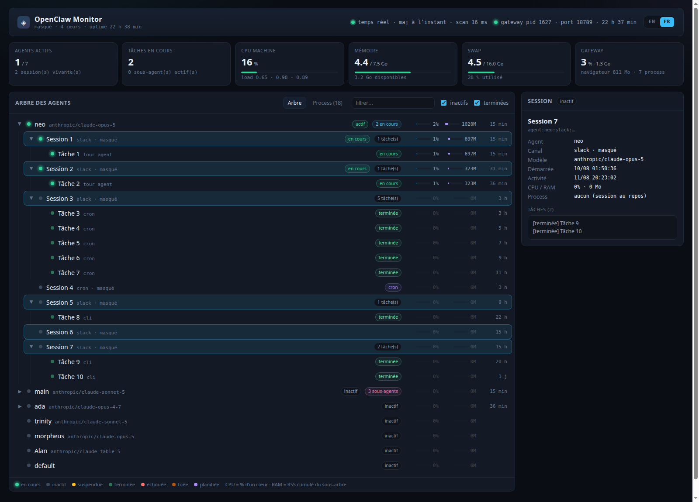

# OpenClaw Task Monitor

[English](README.md) · **Français**

Tableau de bord temps réel pour une installation [OpenClaw](https://github.com/openclaw/openclaw) :
agents, sessions, sous-agents, tâches et consommation CPU/RAM de chaque unité, dans un seul
arbre.

**Aucun appel modèle, aucun token consommé.** L'outil se contente de lire des informations
déjà produites par OpenClaw : base d'état SQLite, fichiers de sessions, transcripts et `/proc`.



## Ce qu'il montre

- **Arbre** `agent → session → sous-agent → tâche`, replié sur les unités inactives
- **État** de chaque unité : en cours · inactif · suspendue · terminée · échouée · tuée · planifiée
- **CPU et RAM par unité** — le CPU est un pourcentage d'un cœur (comme `top`), la RAM le RSS
  cumulé de tout le sous-arbre de process rattaché à l'unité
- **Titre court de la tâche**, extrait du dernier message utilisateur du transcript, pour
  identifier d'un coup d'œil la nature du travail en cours
- **Santé machine** : CPU, mémoire, swap, load, uptime de la gateway
- Panneau de détail vivant, filtre texte, onglet des process bruts
- **Interface en anglais ou en français**, via le sélecteur `EN / FR` en haut à droite
  (anglais par défaut, choix mémorisé dans le navigateur)

## Prérequis

| | |
|---|---|
| OS | Linux — l'outil lit `/proc` |
| Node.js | **≥ 22.5**, imposé par le module natif `node:sqlite` (`node --version` pour vérifier) |
| OpenClaw | une installation locale, lisible par l'utilisateur qui lance le monitor |
| Port | `3200` libre par défaut (configurable) |

Rien d'autre à installer : pas de base de données, pas de service externe, pas de clé d'API.

## Installation et démarrage

### Option A — en service utilisateur systemd (recommandé)

Démarre au boot, redémarre en cas d'échec, plafonné en mémoire. Une seule commande :

```bash
git clone https://github.com/proxydis/openclaw-task-monitor.git
cd openclaw-task-monitor
./install.sh
```

`install.sh` fait tout : installation des dépendances, build de production, génération de
l'unité `~/.config/systemd/user/openclaw-monitor.service`, activation et démarrage. Dès
qu'il affiche `✓ http://127.0.0.1:3200`, ouvre cette URL.

Pour un autre port :

```bash
./install.sh 3300
```

Pour que le service survive à la déconnexion (sinon systemd arrête les services
utilisateur à la fin de la session) :

```bash
sudo loginctl enable-linger "$USER"
```

### Option B — à la main, sans systemd

Utile pour essayer l'outil ou sur une machine sans systemd :

```bash
git clone https://github.com/proxydis/openclaw-task-monitor.git
cd openclaw-task-monitor

npm install                                     # dépendances
npx next build                                  # build de production
cp -r .next/static .next/standalone/.next/static # assets statiques du bundle standalone

PORT=3200 node .next/standalone/server.js       # démarrage
```

Puis ouvrir <http://127.0.0.1:3200>. Arrêt avec `Ctrl+C`.

### Option C — mode développement

Rechargement à chaud, pas d'étape de build :

```bash
npm install
npm run dev     # http://127.0.0.1:3200
```

### Vérifier que ça tourne

```bash
curl -s http://127.0.0.1:3200/api/state | head -c 200   # instantané JSON
```

Un arbre vide signifie en général que le monitor ne regarde pas la bonne installation :
voir `OPENCLAW_HOME` ci-dessous.

## Configuration

Tout se règle par variables d'environnement.

| Variable | Défaut | Rôle |
|---|---|---|
| `PORT` | `3200` | port d'écoute |
| `HOSTNAME` | `127.0.0.1` | interface d'écoute |
| `OPENCLAW_HOME` | `~/.openclaw` | racine de l'installation supervisée |
| `MONITOR_REDACT` | — | `1` masque tout contenu métier (voir ci-dessous) |
| `MONITOR_PLAN_USAGE` | — | `0` désactive la carte des limites de forfait (aucun appel réseau) |
| `MONITOR_PLAN_TTL_MS` | `600000` | période d'interrogation du relevé d'usage ; l'API n'accorde qu'environ un appel toutes les 5 min, descendre plus bas fait limiter le compte |
| `CLAUDE_CONFIG_DIR` | `~/.claude` | emplacement du jeton OAuth Claude Code (lecture seule) |

Avec systemd, éditer l'unité générée puis recharger :

```bash
systemctl --user edit --full openclaw-monitor.service
systemctl --user restart openclaw-monitor.service
```

## Sécurité — à lire avant d'exposer le service

Le tableau de bord affiche **le contenu des demandes envoyées aux agents**, les noms de
canaux et les identifiants de session. Il n'a **aucune authentification**.

- Il écoute sur `127.0.0.1` par défaut. Ne le bindez sur `0.0.0.0` qu'en réseau de confiance,
  ou placez-le derrière un reverse proxy authentifié.
- Pour une capture d'écran, une démo ou une présentation publique, lancez-le avec
  `MONITOR_REDACT=1` : la structure de l'arbre et les mesures CPU/RAM restent intactes, mais
  les énoncés de tâches, noms de canaux, chemins et nom d'hôte sont remplacés par des
  libellés neutres.

## Sources de données (lecture seule)

| Donnée | Source |
|---|---|
| Agents, workspace, modèle | `openclaw.json` + `agents/*/` |
| Sessions, canal, dernière activité | `agents/<id>/sessions/sessions.json` |
| Titre de la tâche en cours | dernier message utilisateur du transcript `.jsonl` (queue du fichier, 512 Ko max) |
| Tâches, sous-agents, flows, cron | `state/openclaw.sqlite`, ouvert en `readOnly` |
| CPU / RAM | `/proc/<pid>/stat`, `/proc/meminfo`, `/proc/stat` |

### Rattachement process → session

La gateway lance chaque runtime CLI (`claude`, `codex`, `gemini`) avec
`--append-system-prompt-file`. Ce fichier contient une ligne
`Runtime: agent=… | session=… | model=…`, ce qui donne un rattachement **exact** process →
session. Tout le sous-arbre du process — serveurs MCP, shells, outils — est comptabilisé sur
cette session. À défaut, le `cwd` du process est comparé aux workspaces déclarés pour
rattacher au moins l'agent. Le reste du sous-arbre de la gateway est comptabilisé comme
« gateway », Chrome comme « navigateur ».

### Tâches en cours

Les tours d'agent CLI ne sont écrits dans `task_runs` qu'à leur terminaison. Une tâche
« en cours » est donc soit une ligne `task_runs` non terminée, soit un **tour synthétisé** à
partir d'un process vivant, titré avec le dernier message utilisateur de la session.

## Coût d'un instantané

Un scan `/proc`, quatre requêtes SQLite et quelques lectures de queue de fichier : 20 à 300 ms,
~60 Mo de RSS. L'instantané est mutualisé entre tous les clients — au plus un scan toutes les
1,5 s — et diffusé en SSE toutes les 2 s. Le service est plafonné à `MemoryMax=600M`.

## API

- `GET /api/state` — instantané JSON complet
- `GET /api/stream` — flux SSE, une trame toutes les 2 s

Les instantanés ne transportent aucun texte d'interface : chaque libellé produit par l'outil
est émis sous forme de clé de traduction (voir `lib/i18n.ts`) et rendu par le navigateur dans
la langue choisie.

## Exploitation

```bash
systemctl --user status  openclaw-monitor      # état
systemctl --user restart openclaw-monitor      # redémarrage
journalctl --user -u openclaw-monitor -n 50    # 50 dernières lignes de log
```

Mise à jour :

```bash
git pull
./install.sh          # reconstruit et redémarre le service
```

Désinstallation :

```bash
systemctl --user disable --now openclaw-monitor.service
rm ~/.config/systemd/user/openclaw-monitor.service
systemctl --user daemon-reload
```

## Dépannage

| Symptôme | Cause et correctif |
|---|---|
| `Cannot find module 'node:sqlite'` | Node.js antérieur à 22.5 — mettre Node à jour |
| `EADDRINUSE` au démarrage | port déjà pris — `./install.sh <autre-port>` |
| La carte du forfait affiche « Anthropic limite les appels… » | normal : le relevé d'usage n'accorde qu'environ un appel toutes les 5 min, quota partagé avec le CLI Claude. Les jauges gardent leur dernière valeur et l'interrogation repart seule ; n'augmenter `MONITOR_PLAN_TTL_MS` que si ça persiste |
| Arbre vide, aucun agent | mauvaise racine d'installation — pointer `OPENCLAW_HOME` sur le dossier qui contient `openclaw.json` |
| Bandeau d'avertissement `sqlite : …` | `state/openclaw.sqlite` illisible (droits, ou gateway jamais démarrée) |
| Page bloquée sur « connexion au flux… » | serveur arrêté ou injoignable — voir `journalctl --user -u openclaw-monitor` |
| CPU à 0 % partout | le monitor ne voit que les process de l'utilisateur qui l'exécute ; le lancer sous l'utilisateur propriétaire de la gateway |

## Licence

MIT — voir [LICENSE](LICENSE).
