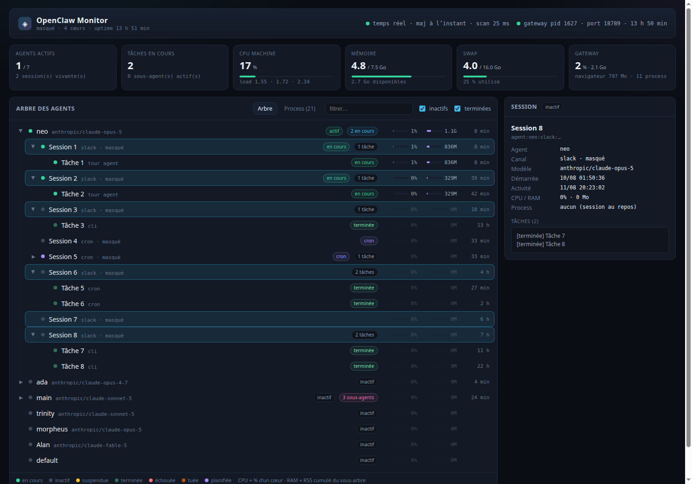

# OpenClaw Task Monitor

Tableau de bord temps réel pour une installation [OpenClaw](https://github.com/openclaw/openclaw) :
agents, sessions, sous-agents, tâches et consommation CPU/RAM de chaque unité, dans un seul
arbre.

**Aucun appel modèle, aucun token consommé.** L'outil se contente de lire des informations
déjà produites par OpenClaw : base d'état SQLite, fichiers de sessions, transcripts et `/proc`.



## Ce qu'il montre

- **Arbre** `agent → session → sous-agent → tâche`, replié sur les unités inactives
- **État** de chaque unité : en cours · inactif · suspendue · terminée · échouée · tuée · planifiée
- **CPU et RAM par unité** — le CPU est un pourcentage d'un cœur (comme `top`), la RAM le RSS
  cumulé de tout le sous-arbre de process rattaché à l'unité
- **Titre court de la tâche**, extrait du dernier message utilisateur du transcript, pour
  identifier d'un coup d'œil la nature du travail en cours
- **Santé machine** : CPU, mémoire, swap, load, uptime de la gateway
- Panneau de détail vivant, filtre texte, onglet des process bruts

## Installation

Prérequis : Node.js ≥ 22 (l'outil utilise le module natif `node:sqlite`), une installation
OpenClaw locale, Linux (lecture de `/proc`).

```bash
git clone https://github.com/<compte>/openclaw-task-monitor.git
cd openclaw-task-monitor
./install.sh          # build + service systemd utilisateur, port 3200 par défaut
./install.sh 3300     # ou un autre port
```

Sans systemd :

```bash
npm install && npx next build
cp -r .next/static .next/standalone/.next/static
PORT=3200 node .next/standalone/server.js
```

### Variables d'environnement

| Variable | Défaut | Rôle |
|---|---|---|
| `PORT` | `3200` | port d'écoute |
| `HOSTNAME` | `127.0.0.1` | interface d'écoute |
| `OPENCLAW_HOME` | `~/.openclaw` | racine de l'installation supervisée |
| `MONITOR_REDACT` | — | `1` masque tout contenu métier (voir ci-dessous) |

## Sécurité — à lire avant d'exposer le service

Le tableau de bord affiche **le contenu des demandes envoyées aux agents**, les noms de
canaux et les identifiants de session. Il n'a **aucune authentification**.

- Il écoute sur `127.0.0.1` par défaut. Ne le bindez sur `0.0.0.0` qu'en réseau de confiance,
  ou placez-le derrière un reverse proxy authentifié.
- Pour une capture d'écran, une démo ou une présentation publique, lancez-le avec
  `MONITOR_REDACT=1` : la structure de l'arbre et les mesures CPU/RAM restent intactes, mais
  les énoncés de tâches, noms de canaux, chemins et nom d'hôte sont remplacés par des
  libellés neutres.

## Sources de données (lecture seule)

| Donnée | Source |
|---|---|
| Agents, workspace, modèle | `openclaw.json` + `agents/*/` |
| Sessions, canal, dernière activité | `agents/<id>/sessions/sessions.json` |
| Titre de la tâche en cours | dernier message utilisateur du transcript `.jsonl` (queue du fichier, 512 Ko max) |
| Tâches, sous-agents, flows, cron | `state/openclaw.sqlite`, ouvert en `readOnly` |
| CPU / RAM | `/proc/<pid>/stat`, `/proc/meminfo`, `/proc/stat` |

### Rattachement process → session

La gateway lance chaque runtime CLI (`claude`, `codex`, `gemini`) avec
`--append-system-prompt-file`. Ce fichier contient une ligne
`Runtime: agent=… | session=… | model=…`, ce qui donne un rattachement **exact** process →
session. Tout le sous-arbre du process — serveurs MCP, shells, outils — est comptabilisé sur
cette session. À défaut, le `cwd` du process est comparé aux workspaces déclarés pour
rattacher au moins l'agent. Le reste du sous-arbre de la gateway est comptabilisé comme
« gateway », Chrome comme « navigateur ».

### Tâches en cours

Les tours d'agent CLI ne sont écrits dans `task_runs` qu'à leur terminaison. Une tâche
« en cours » est donc soit une ligne `task_runs` non terminée, soit un **tour synthétisé** à
partir d'un process vivant, titré avec le dernier message utilisateur de la session.

## Coût d'un instantané

Un scan `/proc`, quatre requêtes SQLite et quelques lectures de queue de fichier : 20 à 300 ms,
~60 Mo de RSS. L'instantané est mutualisé entre tous les clients — au plus un scan toutes les
1,5 s — et diffusé en SSE toutes les 2 s. Le service est plafonné à `MemoryMax=600M`.

## API

- `GET /api/state` — instantané JSON complet
- `GET /api/stream` — flux SSE, une trame toutes les 2 s

## Exploitation

```bash
systemctl --user status  openclaw-monitor
systemctl --user restart openclaw-monitor
journalctl --user -u openclaw-monitor -n 50
```

## Licence

MIT — voir [LICENSE](LICENSE).
